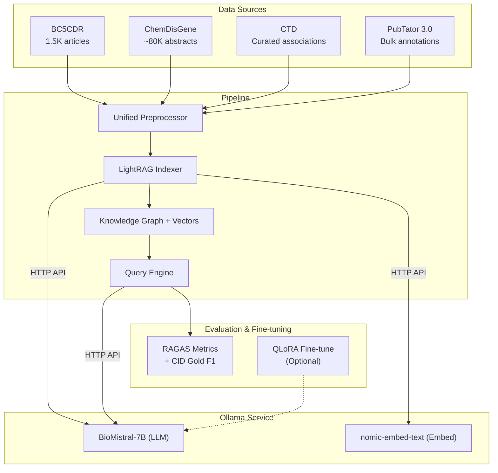
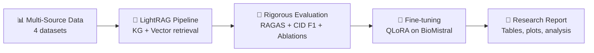

# Biomedical RAG QA with LightRAG + BioMistral-7B (via Ollama)

## Background

The goal is to build, **evaluate**, and optionally **fine-tune** a multi-source RAG QA system for biomedical chemical-disease queries using **LightRAG** + **BioMistral-7B** via **Ollama**.

---

## Architecture Overview



---

## Data Sources (Phased)

| Phase | Dataset | Size | Format | Purpose |
|-------|---------|------|--------|---------|
| 1 | **BC5CDR** | 1,500 articles | PubTator | Core — gold-standard CID relations |
| 2 | **ChemDisGene** | ~80K abstracts | PubTator | Scale — same format, easy integration |
| 3 | **CTD** | ~30M assoc. | CSV | Enrich — curated chemical-disease-gene triples |
| 4 | **PubTator 3.0** | Millions | Bulk FTP | Optional — topic-filtered expansion |

---

## Project Structure

```
biomedical-rag/
├── config.py                 # Model, paths, entity types
├── preprocess.py             # Multi-source → unified docs
├── index.py                  # Build LightRAG KG + vectors
├── query.py                  # QA interface (CLI)
├── evaluate.py               # RAGAS + CID gold evaluation
├── finetune/                 # (Optional) QLoRA fine-tuning
│   ├── prepare_data.py       # BC5CDR → instruction-tuning format
│   ├── train_qlora.py        # QLoRA training script
│   └── export_ollama.py      # Convert to GGUF → Ollama
├── experiments/              # Ablation & comparison results
│   ├── run_ablation.py       # Compare modes, data sources
│   └── results/              # Saved metrics & plots
├── data/
│   ├── CDR_Data/             # BC5CDR (existing)
│   ├── chemdis_gene/         # ChemDisGene
│   ├── ctd/                  # CTD exports
│   └── processed/            # Unified text docs
├── requirements.txt
└── notebooks/
    └── demo.ipynb
```

---

## Proposed Implementation

### Phase 1-3: Setup, Preprocessing, Indexing

*(Install Ollama + BioMistral, parse multi-source data, build LightRAG index)*

```bash
ollama pull biomistral
ollama pull nomic-embed-text
pip install lightrag-hku ragas
```

---

### Phase 4: Evaluation Framework ⭐

This is where the project becomes **research-grade**, not just a deployment.

#### [NEW] [evaluate.py]

**A. RAG Quality Metrics (RAGAS)**

| Metric | What it Measures | Why it Matters |
|--------|-----------------|----------------|
| **Faithfulness** | Are claims in the answer supported by retrieved context? | Detects hallucination |
| **Answer Relevance** | Does the answer actually address the question? | Detects off-topic responses |
| **Context Precision** | Are relevant docs ranked higher? | Measures retrieval quality |
| **Context Recall** | Were all needed docs retrieved? | Measures retrieval coverage |

```python
from ragas import evaluate
from ragas.metrics import faithfulness, answer_relevancy, context_precision, context_recall

# Evaluate on test set
results = evaluate(dataset, metrics=[faithfulness, answer_relevancy, context_precision, context_recall])
```

**B. Task-Specific Evaluation (CID Relation Extraction)**

Using BC5CDR gold-standard CID relations:

1. For each gold relation `(Chemical, Disease)` → query: *"Does {chemical} induce {disease}?"*
2. Parse LLM answer → `yes/no`
3. Compute **Precision / Recall / F1** against gold labels
4. Report per-source accuracy

**C. Ablation Studies** 

| Experiment | What to Compare |
|------------|----------------|
| Retrieval modes | `local` vs `global` vs `hybrid` — which gives best F1? |
| Data source impact | BC5CDR only → +ChemDisGene → +CTD — how does each source improve answers? |
| Model comparison | BioMistral vs base Mistral — does biomedical pretraining help? |
| With/without KG | LightRAG (KG+vector) vs naive RAG (vector only) |

#### [NEW] [experiments/run_ablation.py]

Automated script that:
1. Runs all experiment combinations
2. Saves RAGAS scores + CID F1 for each config
3. Generates comparison tables and plots

---

### Phase 5: Fine-tuning (Optional but Impressive) ⭐

> [!TIP]
> Fine-tuning is **optional** but makes the project stand out. QLoRA lets you fine-tune BioMistral on a single consumer GPU (~8GB VRAM).

#### [NEW] [finetune/prepare_data.py]

Convert BC5CDR into instruction-tuning format:

```json
{
  "instruction": "Given the abstract, extract chemical-disease relations.",
  "input": "Naloxone reverses the antihypertensive effect of clonidine...",
  "output": "Relations found:\n1. alpha-methyldopa INDUCES hypotension (MeSH: D008750 → D007022)"
}
```

#### [NEW] [finetune/train_qlora.py]

```python
# QLoRA: 4-bit quantized fine-tuning (~75% memory savings)
from peft import LoraConfig, get_peft_model
from transformers import BitsAndBytesConfig

qlora_config = LoraConfig(r=16, lora_alpha=32, target_modules=["q_proj", "v_proj"])
bnb_config = BitsAndBytesConfig(load_in_4bit=True, bnb_4bit_compute_dtype=torch.float16)
```

#### [NEW] [finetune/export_ollama.py]

After fine-tuning, export back to Ollama:

```bash
# Merge LoRA weights → convert to GGUF → import to Ollama
python export_ollama.py --model ./finetuned_biomistral
ollama create biomistral-cdr -f Modelfile
```
Then just change config: `LLM_MODEL = "biomistral-cdr"`

---

### Phase 6: Query Interface

Interactive CLI with multiple modes (`local`, `global`, `hybrid`).

### Phase 7: Reporting

Generate final comparison report with tables + plots:
- RAGAS scores across configurations
- CID P/R/F1 before/after fine-tuning
- KG statistics (entities, relations extracted)

---

## Summary: What Makes This a Strong Project



| Component | Just Deploy | ✅ This Plan |
|-----------|-------------|-------------|
| Data | 1 source | 4 sources (phased) |
| Model | Use as-is | Evaluate + optionally fine-tune |
| Evaluation | None | RAGAS + CID F1 + ablations |
| Analysis | None | Mode/source/model comparisons |
| Output | Q&A demo | Demo + metrics + report |

---

## Verification Plan

### Automated
1. Verify Ollama models: `ollama list`
2. Preprocessing: check output file counts per source
3. Indexing: verify KG entity/relation counts
4. RAGAS: all metrics compute without errors
5. CID eval: P/R/F1 output against gold labels

### Manual
1. End-to-end `demo.ipynb` walkthrough
2. Inspect KG for correct biomedical entities
3. Spot-check answers vs. known CID relations
4. Review ablation plots for reasonable trends
